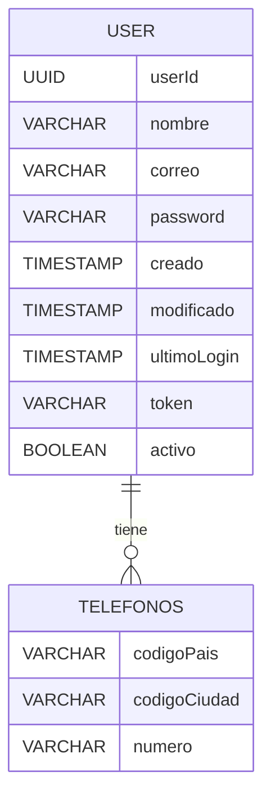

# ntt-usercrud
Evaluación: JAVA


## Ejecutar la aplicación

* Clonar el repositorio al equipo local

```
$ git clone {URL}
```

* Ejecutar la aplicación

```
$ mvn spring-boot:run
```

## API First

La presente aplicacion utilizo un generador de codigo para construir el codigo Java que
implementa la deficion del API definida en el documento OpenAPI

[OpenAPI Document](./docs/openapi-ntt-usercrud.yaml)

## Modelo de Datos

